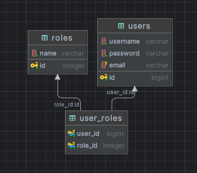

# Description

REST application that implements authentication and authorization using 3 methods:
* DaoAuthentication
* JdbcUserAuthentication
* InMemoryAuthentication

# Getting Started

To start the project, you need to connect to a local database, and also specify the connection parameters in the file application.yml. It is also necessary to use the correct database schema.

ER-model database:



The following definitions are required to create a base:

```postgresql

create table users
(
    id       bigserial
        primary key,
    username varchar not null,
    password varchar not null,
    email    varchar
        unique
);

alter table users
    owner to postgres;

create table roles
(
    id   serial
        primary key,
    name varchar not null
);

alter table roles
    owner to postgres;

create table user_roles
(
    user_id bigint  not null
        references users,
    role_id integer not null
        references roles,
    primary key (user_id, role_id)
);

alter table user_roles
    owner to postgres;

```